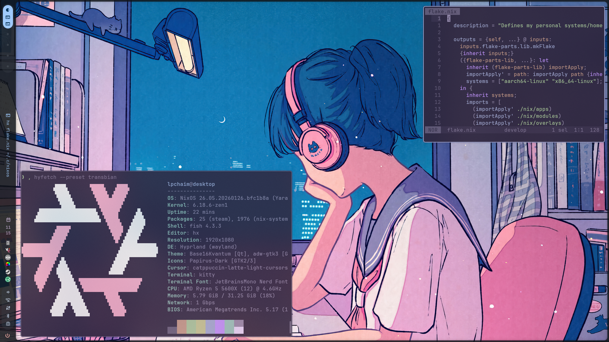

[ez-configs]: https://github.com/ehllie/ez-configs/
[haumea]: https://github.com/nix-community/haumea
[flake-parts]: https://github.com/hercules-ci/flake-parts
[flake-schemas]: https://github.com/DeterminateSystems/flake-schemas
[stylix]: https://github.com/danth/stylix

<p align="center">
    <i href="https://github.com/lpchaim/nixos/actions/workflows/check.yml">
        
    </i>
    <i href="https://github.com/lpchaim/nixos/actions/workflows/build.yml">
        
    </i>
</p>

<p align="center">
    
</p>

---

Welcome to my NixOS flake! It's mostly powered by [flake-parts], with some [haumea] sprinkled in for painless module loading here and there.

This is mainly for my NixOS configurations, but it also has a couple standalone Home Manager configs, development shells and NixOS/Home Manager modules.

## Design goals

- Simple, easy to parse and short system/home configurations
    - Minimal boilerplate
    - Largely orthogonal `profiles` instead of one-off module options, e.g. enable `my.profiles.gaming = true` instead of specifying several options per host
- Good separation of concerns and modularity, I dislike how monolithic flakes tend to turn out
    - Huge shoutout to [flake-parts] for helping with this!
- No libraries with too much magic behind how they work
  - As little obfuscation as possible on how things work, compose my own tools from more barebones ones as needed

I use [ez-configs] to get some boilerplate out of the way when it comes to setting up systems and home configurations. I usually define home configurations directly on the system configurations themselves since they tend to have similar functionality goals and complimentary options anyway.

I have plenty of custom HM and NixOS modules, so I use `profiles` to group them together and massively simplify my configs. They also have enough smarts to, for instance, enable the `gnome` Home Manager module by default if the host system has the same module enabled.

As an example, this is a working NixOS configuration describing my main rig.

```nix
{inputs, ...}: let
  inherit (inputs.self.lib.config) name;
  inherit (inputs.self.lib.storage.btrfs) mkStorage;
  inherit (inputs.self.lib.storage.ntfs) mkSecondaryStorage;
in {
  imports = [
    ./hardware-configuration.nix
    (mkStorage {
      device = "/dev/disk/by-id/nvme-Corsair_MP600_PRO_XT_214279380001310131BD";
      swapSize = "35G";
    })
    (mkSecondaryStorage {
      device = "/dev/disk/by-id/ata-ADATA_SU630_2J0220042661-part1";
      mountPoint = "/run/media/${name.user}/storage";
    })
    {
      home-manager.users.${name.user} = {
        home.stateVersion = "24.11";
      };
    }
  ];

  my.profiles = {
    formfactor.desktop = true;
    de.gnome = true;
    de.hyprland = true;
    hardware.gpu.nvidia = true;
    hardware.rgb = true;
  };
  my.gaming.enable = true;
  my.networking.tailscale.trusted = true;
  my.security.secureboot.enable = true;

  system.stateVersion = "23.11";
}
```

## Look and feel

I daily drive Hyprland with a slightly tweaked version of aylur's ags dotfiles and rofi as an app launcher.

My systems wouldn't look even halfway as good without [stylix] doing all the heavy-lifting in my stead.
The color scheme used in my screenshots is `stella`.

## File structure

I'm hoping the file structure under `/nix` is mostly self-explanatory. That said, there are a couple that bear explaining:
- `modules` for flake modules consumed by [flake-parts]
- `schemas` for my custom [flake-schemas] definitions
- `shared` for configuration and modules useful to both and NixOS and Home Manager

<details open>
<summary>Tree view of the directory structure</summary>

```sh
./nix
├── apps
│   ├── assets.nix
│   ├── ci.nix
│   └── default.nix
├── home
│   ├── configs
│   └── modules
├── lib
│   ├── config.nix
│   ├── default.nix
│   ├── loaders.nix
│   ├── shell.nix
│   ├── storage
│   └── strings.nix
├── modules
│   ├── default.nix
│   ├── ezConfigs.nix
│   └── gitHooks.nix
├── nixos
│   ├── configs
│   └── modules
├── overlays
│   └── default.nix
├── packages
│   └── default.nix
├── schemas
│   ├── default.nix
│   ├── lib.nix
│   └── pkgs.nix
├── shared
│   ├── default.nix
│   └── theming.nix
└── shells
    ├── default.nix
    └── lib.nix
```
</details>

## Outputs

If you're curious, this is what the flake actually outputs right now.
Courtesy of [flake-schemas]' patches with my own lib/pkgs schemas on top.

<details>
<summary>Output of `nix flake show`</summary>

```sh
git+file:///home/lpchaim/.config/nixos
├───apps
│   ├───aarch64-linux
│   │   ├───generate-assets: app
│   │   ├───generate-ci-matrix: app
│   │   └───render-readme: app
│   └───x86_64-linux
│       ├───generate-assets: app
│       ├───generate-ci-matrix: app
│       └───render-readme: app
├───checks
│   ├───aarch64-linux
│   │   └───pre-commit: CI test [pre-commit-run]
│   └───x86_64-linux
│       └───pre-commit: CI test [pre-commit-run]
├───darwinConfigurations
├───darwinModules
├───devShells
│   ├───aarch64-linux
│   │   ├───default: development environment [nix-shell]
│   │   ├───deploy: development environment [nix-shell]
│   │   └───rust: development environment [nix-shell]
│   └───x86_64-linux
│       ├───default: development environment [nix-shell]
│       ├───deploy: development environment [nix-shell]
│       └───rust: development environment [nix-shell]
├───formatter
│   ├───aarch64-linux: package [alejandra-3.1.0]
│   └───x86_64-linux: package [alejandra-3.1.0]
├───homeConfigurations
│   ├───"cheina@pc079": Home Manager configuration [home-manager-generation]
│   ├───"lpchaim@desktop": Home Manager configuration [home-manager-generation]
│   ├───"lpchaim@laptop": Home Manager configuration [home-manager-generation]
│   ├───"lpchaim@raspberrypi": Home Manager configuration [home-manager-generation]
│   └───"lpchaim@steamdeck": Home Manager configuration [home-manager-generation]
├───homeModules
│   ├───base: Home Manager module
│   ├───cli: Home Manager module
│   ├───default: Home Manager module
│   ├───gaming: Home Manager module
│   ├───gui: Home Manager module
│   ├───profiles: Home Manager module
│   ├───syncthing: Home Manager module
│   └───theming: Home Manager module
├───legacyPackages
│   └───(skipped; use '--legacy' to show)
├───lib
│   ├───config: library namespace
│   ├───isNvidia: library function
│   ├───loaders: library namespace
│   ├───mkPkgs: library function
│   ├───shell: library namespace
│   ├───storage: library namespace
│   └───strings: library namespace
├───nixosConfigurations
│   ├───desktop: NixOS configuration [nixos-system-desktop-25.05.20241229.88195a9]
│   ├───laptop: NixOS configuration [nixos-system-laptop-25.05.20241229.88195a9]
│   ├───raspberrypi: NixOS configuration [nixos-system-raspberrypi-25.05.20241229.88195a9]
│   └───steamdeck: NixOS configuration [nixos-system-steamdeck-25.05.20241229.88195a9]
├───nixosModules
│   ├───base: NixOS module
│   ├───boot: NixOS module
│   ├───default: NixOS module
│   ├───desktop: NixOS module
│   ├───gaming: NixOS module
│   ├───hardware: NixOS module
│   ├───kdeconnect: NixOS module
│   ├───locale: NixOS module
│   ├───networking: NixOS module
│   ├───profiles: NixOS module
│   ├───programs: NixOS module
│   ├───secrets: NixOS module
│   ├───secureboot: NixOS module
│   ├───security: NixOS module
│   ├───services: NixOS module
│   ├───syncthing: NixOS module
│   └───tailscale: NixOS module
├───overlays
├───packages
│   ├───aarch64-linux
│   └───x86_64-linux
├───pkgs
│   ├───aarch64-linux: nixpkgs instance
│   └───x86_64-linux: nixpkgs instance
└───schemas
    ├───apps: flake schema
    ├───checks: flake schema
    ├───darwinConfigurations: flake schema
    ├───darwinModules: flake schema
    ├───devShells: flake schema
    ├───dockerImages: flake schema
    ├───formatter: flake schema
    ├───homeConfigurations: flake schema
    ├───homeModules: flake schema
    ├───hydraJobs: flake schema
    ├───legacyPackages: flake schema
    ├───lib: flake schema
    ├───nixosConfigurations: flake schema
    ├───nixosModules: flake schema
    ├───overlays: flake schema
    ├───packages: flake schema
    ├───pkgs: flake schema
    ├───schemas: flake schema
    └───templates: flake schema
```
</details>
