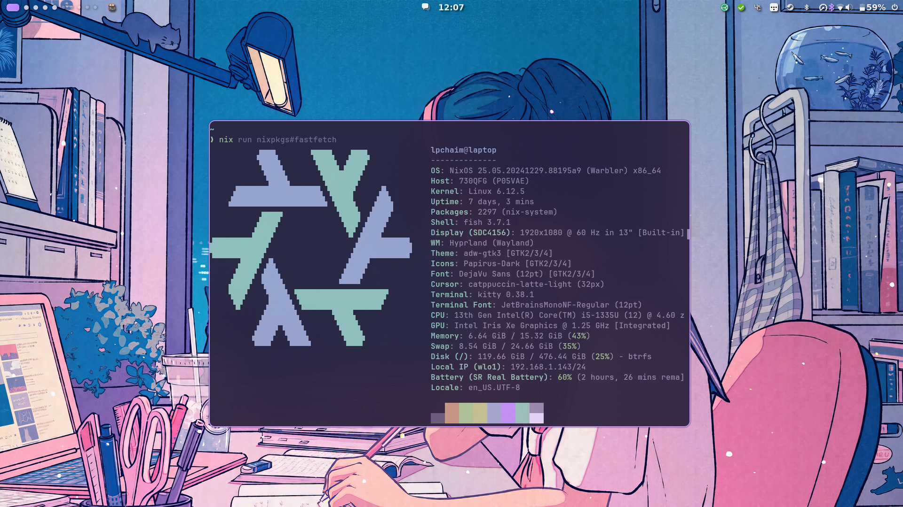

[dms]: https://github.com/AvengeMedia/DankMaterialShell
[ez-configs]: https://github.com/ehllie/ez-configs/
[flake-parts]: https://github.com/hercules-ci/flake-parts
[flake-schemas]: https://github.com/DeterminateSystems/flake-schemas
[rofi]: https://github.com/davatorium/rofi
[stylix]: https://github.com/danth/stylix

<p align="center">
    <i href="https://github.com/lpchaim/nixos/actions/workflows/check.yml">
        
    </i>
    <i href="https://github.com/lpchaim/nixos/actions/workflows/build.yml">
        
    </i>
</p>

<p align="center">
    
</p>

---

Welcome to my Nix flake, powered by [flake-parts]!

This is mainly for my NixOS configurations, but it also has a couple standalone Home Manager configs, packages, development shells and NixOS/Home Manager modules.

## Design goals

- Simple, easy to parse and short system/home configurations
    - Minimal boilerplate
    - Largely orthogonal `profiles` instead of one-off module options, e.g. enable `my.profiles.gaming = true` instead of specifying several options per host
- Good separation of concerns and modularity, I dislike how monolithic flakes tend to turn out
    - Huge shoutout to [flake-parts] for helping with this!
- No libraries with too much magic behind how they work
  - As little obfuscation as possible on how things work, compose my own tools from more barebones ones as needed

I use [ez-configs] to get some boilerplate out of the way when it comes to setting up systems and home configurations. I usually define home configurations directly on the system configurations themselves since they tend to have similar functionality goals and complimentary options anyway.

I have plenty of custom HM and NixOS modules, so I use `profiles` to group them together and massively simplify my configs. They also have enough smarts to, for instance, enable the `gnome` Home Manager module by default if the host system has the same module enabled.

As an example, this is a working NixOS configuration describing my main rig.

```nix
{config, ...}: let
  inherit (config.my.config) name;
in {
  imports = [
    ./hardware-configuration.nix
    ./storage.nix
  ];

  my = {
    ci.build = true;
    gaming.enable = true;
    networking.tailscale.trusted = true;
    users.emily.enable = true;
    profiles = {
      formfactor.desktop = true;
      hardware.gpu.nvidia = true;
      hardware.rgb = true;
      de.gnome = true;
      de.hyprland = true;
      graphical = true;
    };
  };

  networking.interfaces.enp6s0.wakeOnLan.enable = true;

  age.rekey.hostPubkey = "ssh-ed25519 AAAAC3NzaC1lZDI1NTE5AAAAIMNf+oynlWr+Xq3UYKpCy8ih/w9sT6IuIKAtYjo6sfJr";
  system.stateVersion = "23.11";
  home-manager.users.${name.user}.home.stateVersion = "24.11";
}
```

## Look and feel

I daily drive Hyprland with [dms] and [rofi].

My systems wouldn't look even halfway as good without [stylix] doing all the heavy-lifting in my stead.
The color scheme used in my screenshots is `stella`.

## File structure

I'm hoping the file structure under `/nix` is mostly self-explanatory. That said, there are a couple that bear explaining:
- `modules` for flake modules consumed by [flake-parts]
- `schemas` for my custom [flake-schemas] definitions
- `shared` for configuration and modules useful to both and NixOS and Home Manager

<details>
<summary>Tree view of the directory structure</summary>

```sh
./nix
├── apps
│   ├── assets.nix
│   ├── ci.nix
│   └── default.nix
├── checks
│   ├── default.nix
│   └── homeConfigurations.nix
├── flakeModules
│   ├── agenixRekey.nix
│   ├── default.nix
│   ├── ezConfigs.nix
│   ├── gitHooks.nix
│   └── just.nix
├── home
│   ├── configs
│   ├── modules
│   └── profiles
├── legacyPackages
│   ├── ciMatrix.nix
│   ├── default.nix
│   └── scripts
├── lib
│   ├── config.nix
│   ├── default.nix
│   ├── secrets.nix
│   ├── storage
│   └── strings.nix
├── nixos
│   ├── configs
│   ├── modules
│   └── profiles
├── overlays
│   ├── default.nix
│   ├── external.nix
│   ├── lix.nix
│   ├── nixpkgsVersions.nix
│   ├── nuInterpreterStdin.nix
│   ├── packages.nix
│   └── python.nix
├── packages
│   ├── default.nix
│   └── lichen
├── schemas
│   ├── agenixRekey.nix
│   ├── default.nix
│   ├── lib.nix
│   └── systems.nix
├── shared
│   ├── default.nix
│   ├── flatpak.nix
│   ├── nix.nix
│   ├── secrets.nix
│   └── theming.nix
└── shells
    ├── default.nix
    ├── deploy.nix
    ├── maintenance.nix
    ├── minimal.nix
    ├── nix.nix
    └── rust.nix
```
</details>

## Outputs

If you're curious, this is what the flake actually outputs right now.
Courtesy of [flake-schemas]' patches with my own lib/pkgs schemas on top.

<details>
<summary>Output of `nix flake show`</summary>

```sh
git+file:///home/lpchaim/.config/nixos
├───agenix-rekey
│   ├───aarch64-linux
│   │   ├───edit-view: agenix-rekey executable
│   │   ├───generate: agenix-rekey executable
│   │   ├───rekey: agenix-rekey executable
│   │   └───update-masterkeys: agenix-rekey executable
│   └───x86_64-linux
│       ├───edit-view: agenix-rekey executable
│       ├───generate: agenix-rekey executable
│       ├───rekey: agenix-rekey executable
│       └───update-masterkeys: agenix-rekey executable
├───apps
│   ├───aarch64-linux
│   │   ├───generate-assets: app
│   │   ├───generate-ci-matrix: app
│   │   └───render-readme: app
│   └───x86_64-linux
│       ├───generate-assets: app
│       ├───generate-ci-matrix: app
│       └───render-readme: app
├───checks
│   ├───aarch64-linux
│   │   ├───deploy-shell: CI test [nix-shell]
│   │   ├───maintenance-shell: CI test [nix-shell]
│   │   ├───minimal-shell: CI test [nix-shell]
│   │   ├───nix-shell: CI test [nix-shell]
│   │   ├───pre-commit: CI test [pre-commit-run]
│   │   └───rust-shell: CI test [nix-shell]
│   └───x86_64-linux
│       ├───deploy-shell: CI test [nix-shell]
│       ├───"homeConfigurations.cheina@pc082": CI test [home-manager-generation]
│       ├───maintenance-shell: CI test [nix-shell]
│       ├───minimal-shell: CI test [nix-shell]
│       ├───nix-shell: CI test [nix-shell]
│       ├───pre-commit: CI test [pre-commit-run]
│       └───rust-shell: CI test [nix-shell]
├───darwinConfigurations
├───darwinModules
├───devShells
│   ├───aarch64-linux
│   │   ├───default: development environment [maintenance-shell]
│   │   ├───deploy: development environment [deploy-shell]
│   │   ├───maintenance: development environment [maintenance-shell]
│   │   ├───minimal: development environment [minimal-shell]
│   │   ├───nix: development environment [nix-shell]
│   │   └───rust: development environment [rust-shell]
│   └───x86_64-linux
│       ├───default: development environment [maintenance-shell]
│       ├───deploy: development environment [deploy-shell]
│       ├───maintenance: development environment [maintenance-shell]
│       ├───minimal: development environment [minimal-shell]
│       ├───nix: development environment [nix-shell]
│       └───rust: development environment [rust-shell]
├───formatter
│   ├───aarch64-linux: formatter [alejandra-4.0.0]
│   └───x86_64-linux: formatter [alejandra-4.0.0]
├───homeConfigurations
│   ├───"cheina@pc082": Home Manager configuration [home-manager-generation]
│   ├───"lpchaim@desktop": Home Manager configuration [home-manager-generation]
│   ├───"lpchaim@laptop": Home Manager configuration [home-manager-generation]
│   ├───"lpchaim@raspberrypi": Home Manager configuration [home-manager-generation]
│   └───"lpchaim@steamdeck": Home Manager configuration [home-manager-generation]
├───homeModules
│   ├───bars: Home Manager module
│   ├───ci: Home Manager module
│   ├───cli: Home Manager module
│   ├───de: Home Manager module
│   ├───default: Home Manager module
│   ├───development: Home Manager module
│   ├───gui: Home Manager module
│   ├───misc: Home Manager module
│   ├───nix: Home Manager module
│   ├───scripts: Home Manager module
│   ├───secrets: Home Manager module
│   ├───security: Home Manager module
│   ├───ssh: Home Manager module
│   ├───syncthing: Home Manager module
│   ├───theming: Home Manager module
│   └───wayland: Home Manager module
├───legacyPackages
│   └───(skipped; use '--legacy' to show)
├───lib
│   ├───carapaceSpecFromNuScript: library function
│   ├───config: library namespace
│   ├───isNvidia: library function
│   ├───mkPkgs: library function
│   ├───nixFilesToAttrs: library function
│   ├───secrets: library namespace
│   ├───storage: library namespace
│   └───strings: library namespace
├───nixosConfigurations
│   ├───desktop: NixOS configuration [nixos-system-desktop-26.05.20260211.ec7c70d]
│   ├───laptop: NixOS configuration [nixos-system-laptop-26.05.20260211.ec7c70d]
│   ├───raspberrypi: NixOS configuration [nixos-system-raspberrypi-26.05.20260211.ec7c70d]
│   └───steamdeck: NixOS configuration [nixos-system-steamdeck-26.05.20260211.ec7c70d]
├───nixosModules
│   ├───boot: NixOS module
│   ├───ci: NixOS module
│   ├───default: NixOS module
│   ├───desktop: NixOS module
│   ├───gaming: NixOS module
│   ├───gui: NixOS module
│   ├───hardware: NixOS module
│   ├───kdeconnect: NixOS module
│   ├───kernel: NixOS module
│   ├───locale: NixOS module
│   ├───networking: NixOS module
│   ├───nix: NixOS module
│   ├───pipewire: NixOS module
│   ├───programs: NixOS module
│   ├───secrets: NixOS module
│   ├───secureboot: NixOS module
│   ├───security: NixOS module
│   ├───services: NixOS module
│   ├───ssh: NixOS module
│   ├───steamos: NixOS module
│   ├───syncthing: NixOS module
│   ├───tailscale: NixOS module
│   ├───theming: NixOS module
│   ├───users: NixOS module
│   ├───virtualization: NixOS module
│   ├───wayland: NixOS module
│   └───zram: NixOS module
├───overlays
│   ├───external: Nixpkgs overlay
│   ├───lix: Nixpkgs overlay
│   ├───nixpkgsVersions: Nixpkgs overlay
│   ├───nuInterpreterStdin: Nixpkgs overlay
│   ├───packages: Nixpkgs overlay
│   └───python: Nixpkgs overlay
├───packages
│   ├───aarch64-linux
│   │   └───lichen: package [lichen-0.22.0-unstable]
│   └───x86_64-linux
│       └───lichen: package [lichen-0.22.0-unstable]
├───schemas
│   ├───agenix-rekey: flake schema
│   ├───apps: flake schema
│   ├───bundlers: flake schema
│   ├───checks: flake schema
│   ├───darwinConfigurations: flake schema
│   ├───darwinModules: flake schema
│   ├───devShells: flake schema
│   ├───dockerImages: flake schema
│   ├───formatter: flake schema
│   ├───homeConfigurations: flake schema
│   ├───homeModules: flake schema
│   ├───hydraJobs: flake schema
│   ├───legacyPackages: flake schema
│   ├───lib: flake schema
│   ├───nixosConfigurations: flake schema
│   ├───nixosModules: flake schema
│   ├───overlays: flake schema
│   ├───packages: flake schema
│   ├───schemas: flake schema
│   ├───systems: flake schema
│   └───templates: flake schema
└───systems
    ├───aarch64-linux: supported system
    └───x86_64-linux: supported system
```
</details>
